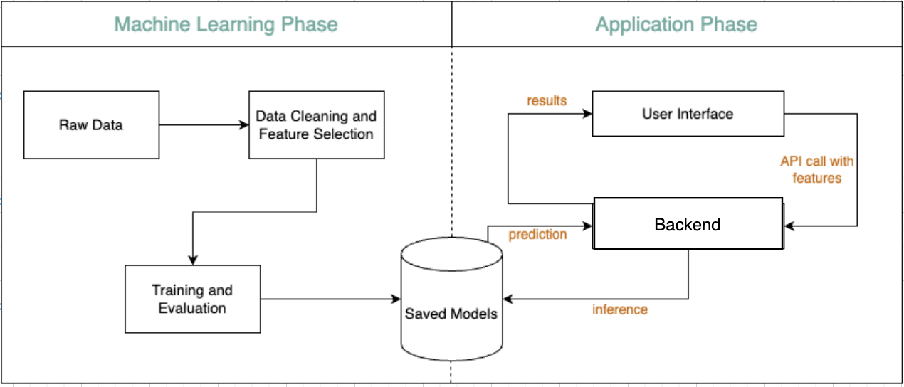

## Project Documentation

### User Manual

- Pre-requisites: You have anaconda/miniconda installed and set up on your machine. Follow steps from [here](https://docs.conda.io/projects/conda/en/latest/user-guide/install/) if you don't have it installed already.

- Create the conda environment from the environment.yml file and activate it. 

```bash
conda env create -f environment.yml
conda activate gluco
```

Note: You might have to follow different steps to install the environment depending on your OS. But just use the environment.yml file as a reference and install the packages manually if needed.

### Proposed Model Architecture



