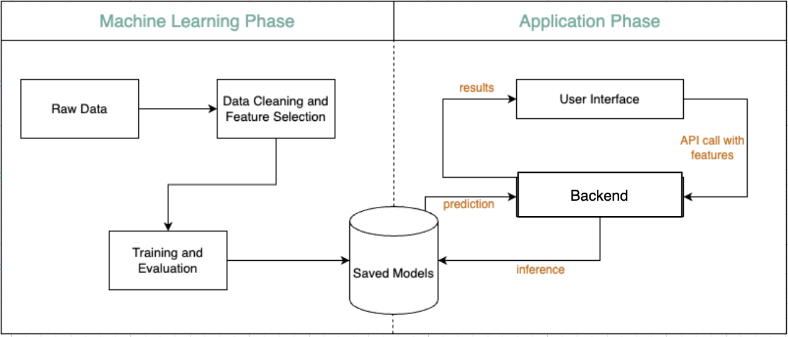

## Project Documentation

### User Manual

- Pre-requisites: You have anaconda/miniconda installed and set up on your machine. Follow steps from [here](https://docs.conda.io/projects/conda/en/latest/user-guide/install/) if you don't have it installed already.

- Create the conda environment from the environment.yml file and activate it. 

```bash
conda env create -f environment.yml
conda activate gluco
```

Note: You might have to follow different steps to install the environment depending on your OS. But just use the environment.yml file as a reference and install the packages manually if needed.

### Proposed Model Architecture




## Project structure

- streamlit: Contains the streamlit app - all the frontend code.
- notebooks: Contains the notebooks used for data exploration and model training.
- data: Dump all data files here.
- src: Can add any helper functions and other reusable code here.

## Starting the app

### Start the flask server

- Go into the src/prediction folder and start the flask server

```bash
cd src/prediction
python prediction.py
```

### Start the streamlit app

- Go to the root of the project and start the streamlit app

```bash
streamlit run streamlit/main.py
```

### Prediction Screen

- Input section:. 
    - The user must first enter some basic health information related to diabetes prediction. 
    - Then the user can also choose a target feature to compare against the entire population. 

- Output section:
    - The table on the top shows the probabilities of the patient having or not having diabetes. 
    - We also present a scatter plot of the entire population for the target feature (where red and blue dots represent diabetic and non-diabetic patients respectively). This can give the patient a good understanding of where they stand against the entire population 

### Insights Screen

- Input section:
    - The user can choose a feature to explore. 

- Output section:
    - The bar chart on the top shows the overall distribution of positive and negative labels from the dataset. 
    - The bar chart below then shows the mean of the selected feature between the positive and negative labels. 

